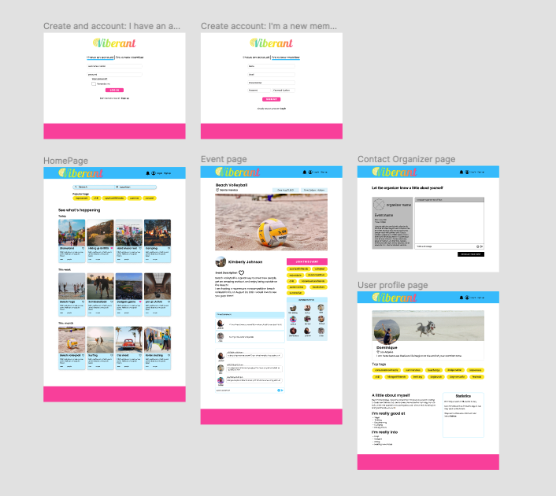

# Viberant - Client

[Viberant Home Page](https://admiring-spence-c2dab0.netlify.app/)

## Tech Stack
- MongoDB
- Express
- React
- Node
- Mongoose
- Bootstrap
- Styled-Components
- Javascript
- HTML
- CSS

Viberant utilizes a MongoDB and Mongoose to manage it's data, a React front-end utilizing Bootstrap, in-line CSS, and styled-components for styling. Viberant's back-end is built with Express and Node.

---

## General Apporach
    On Friday, we figured out who our teams were and decided what roles which people would take in building project three.  Rei handled the backend components, George took the lead, and Andie and Becky handled the front end.  On Monday we met our UX team and spent the morning brainstorming ideas. We each came up with five ideas, presented to the team, and from there we picked our favorite one and ran with it.  

    While we waited for the UX team to design, we built out our site using miro.  Then we slowly built out components and potential schemas organized by using the GitHub kanban board.  Monday afternoon the UX team had designed the site and showed us their final idea.  We decided we would each just have a single branch to work from, George delegated out necessary jobs, once we completeed them we would send a pull requests, and pull from main.  Ultimately, our success was due to great communication and teamwork.  

---

## Dependencies
    axios
    components
    dotenv
    jsonwebtoken
    react
    react-bootstrap
    react-router-dom
    styled-components

    To install:
        type into your terminal: npm i
            -this will download all the dependencies for the front end
            -dotenv will hold the secret components like backend URL
    
    To see the backend components:
        https://github.com/Consecratio/mern-auth-server

    * If you download both front and back end components you will still not be able to get the site to work because there are hidden tokens and passwords that one would need to create on their own.

---

## User Stories
[Google Doc](https://docs.google.com/presentation/d/1o-N73p7TFKX3lWOm04fZ8dd7LCB_8UJpXgio2jp2VfY/edit#slide=id.ge2e350c427_2_34)

    Younger people, espcially those aged 16-24, who couldn't attend school or college for the past year (COVID), are particularly in need of new friends and says to socialize.  This is a one stop web app where they can find activities, create new activites, and be able to go out and socialize after being stuck inside for a year!

---

## Simple wireframes

- [Figma Board](https://www.figma.com/files/recent?fuid=996457699262928382)
- [Miro Board](https://miro.com/app/board/o9J_l7R4OxI=/)

---

## Major Hurdles
    We had major issues with our packagelock.json file initially
